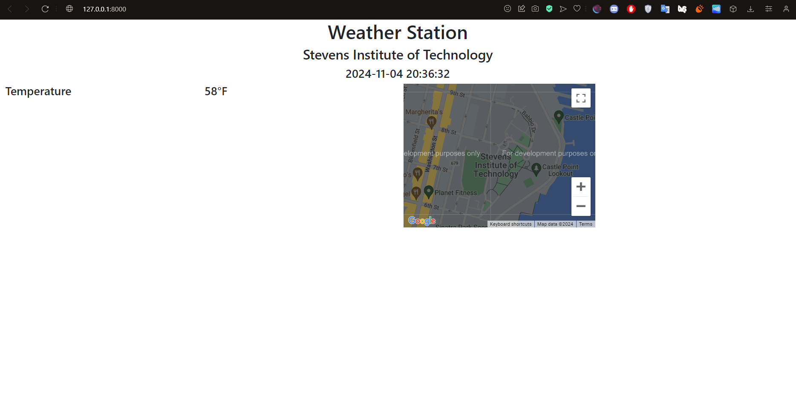
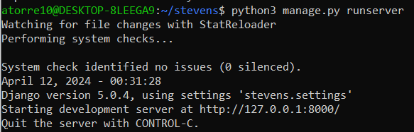
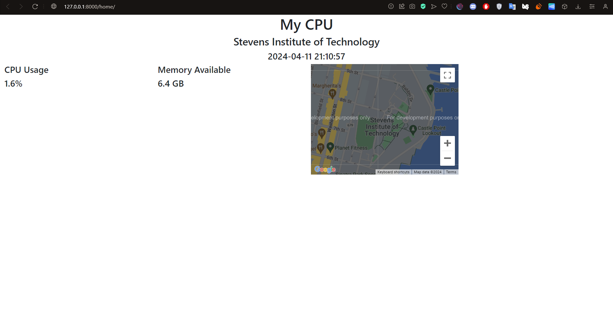
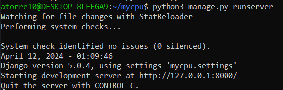
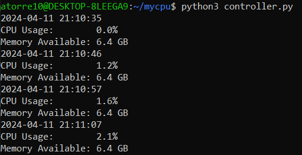
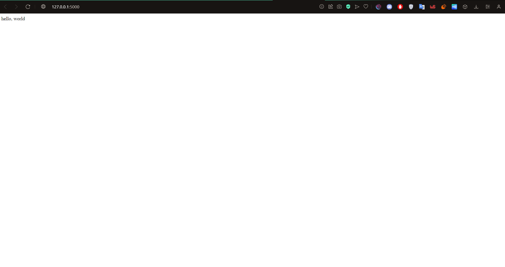
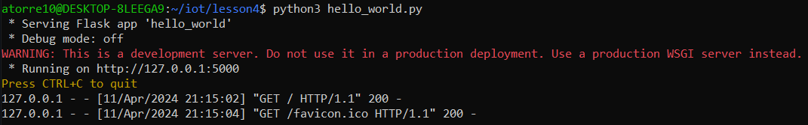

# Lab 4 — Django and Flask

### "stevens"

website

running `$ python3 manage.py runserver`

---
### "mycpu"

website

running `$ python3 manage.py runserver`

running `$ python3 controller.py`

---
### "hello_world.py"

website

running `$ python3 hello_world.py`

