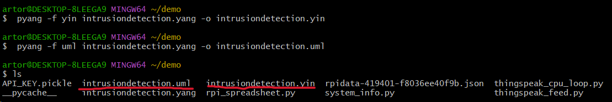
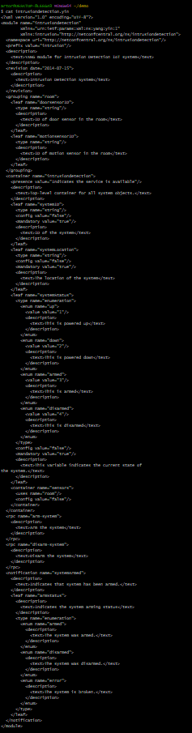
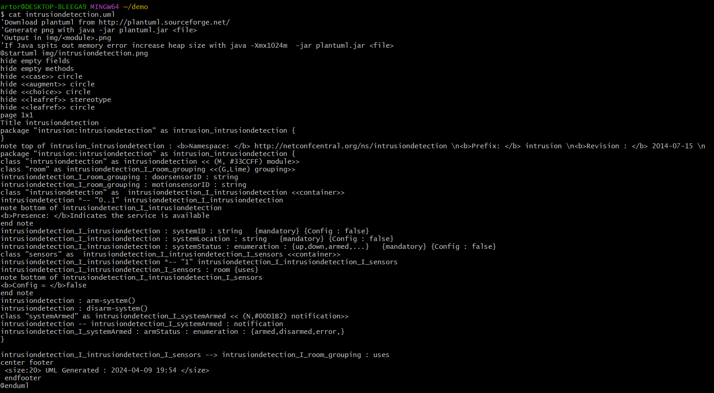
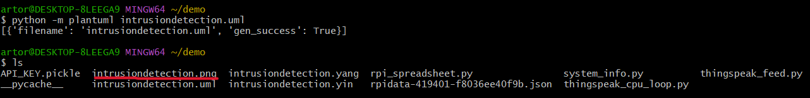
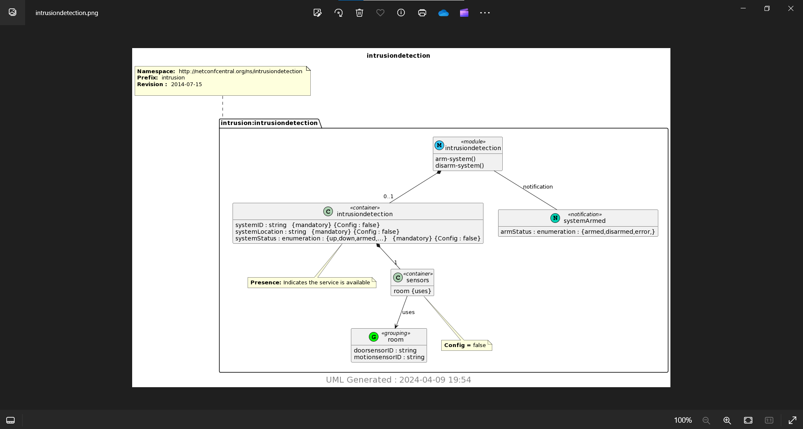

# Lab 9 — YANG

used pyang to generate a `.yin` and `.uml` file with the following code

`$ pyang -f yin -o intrusiondetection.yang intrusiondetection.yin`

`$ pyang -f uml -o intrusiondetection.yang intrusiondetection.uml`

---

ran `$ cat intrusiondetection.yin`

---
ran `$ cat intrusiondetection.uml`

---
ran `$ python -m plantuml intrusiondetection.uml` to generate a png file

the generated png file named `intrusiondetection.png`

