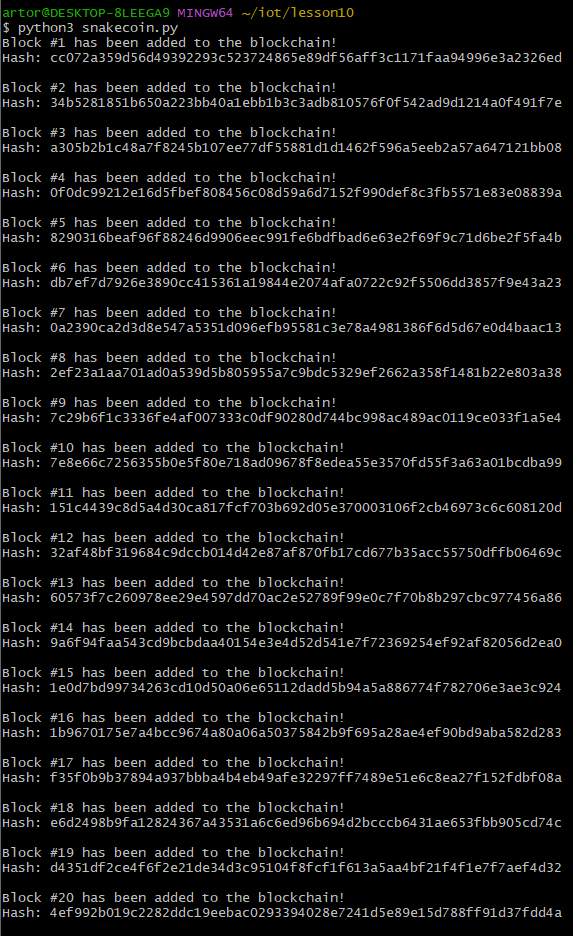
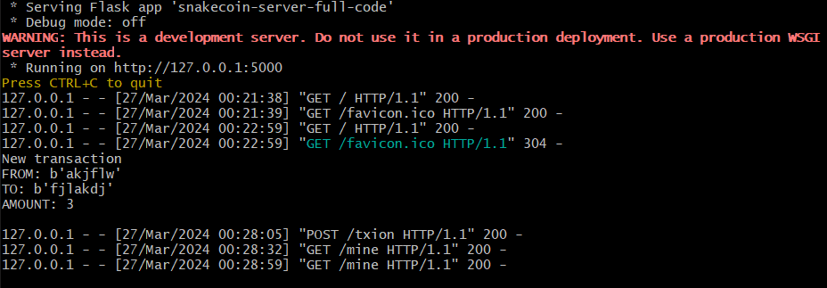
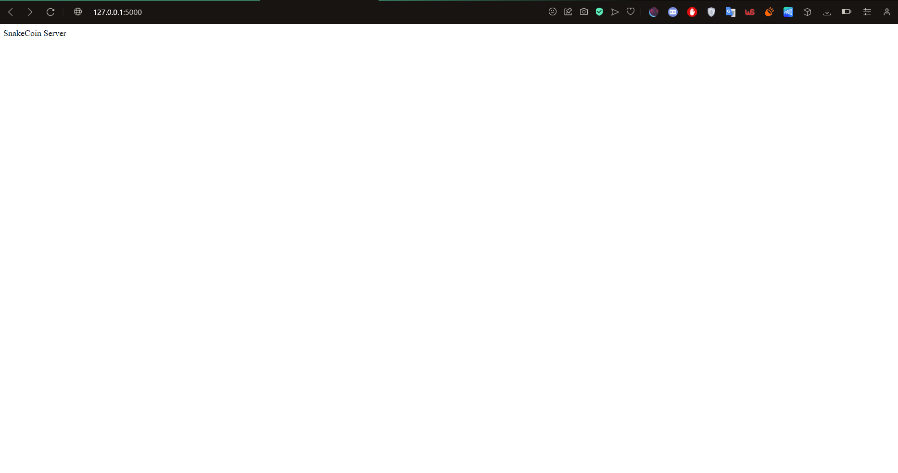
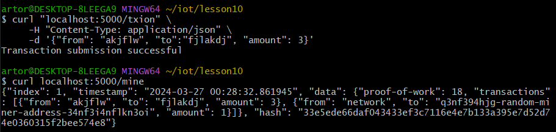
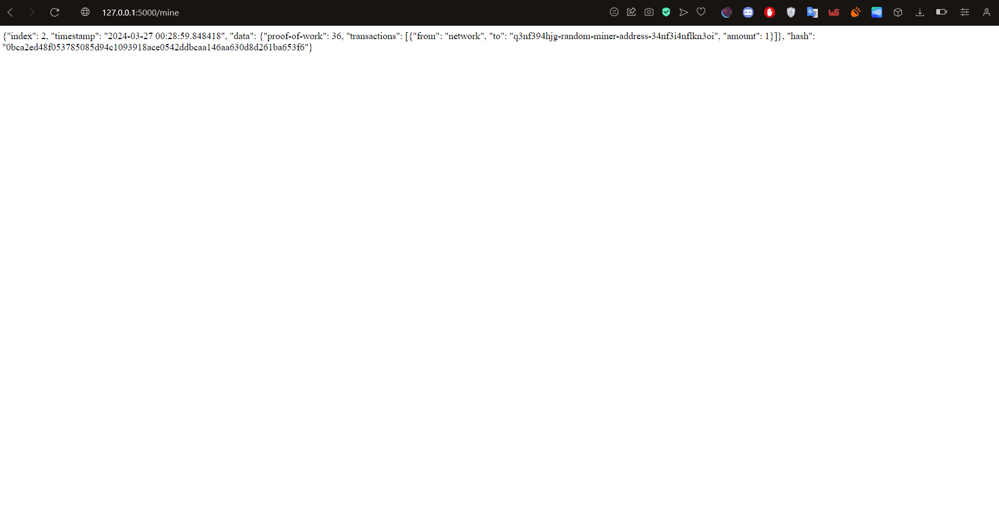
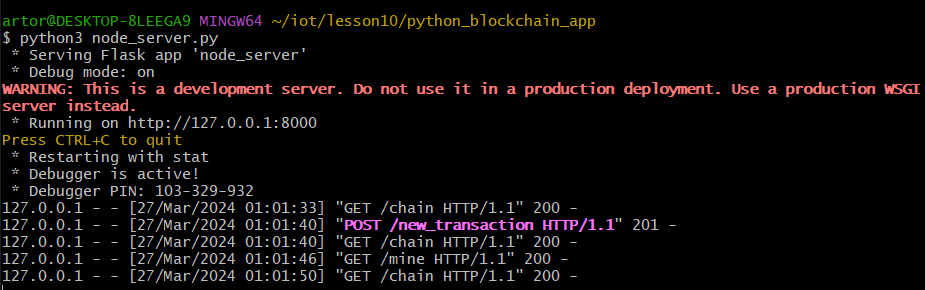
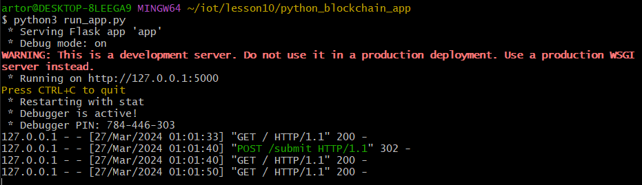
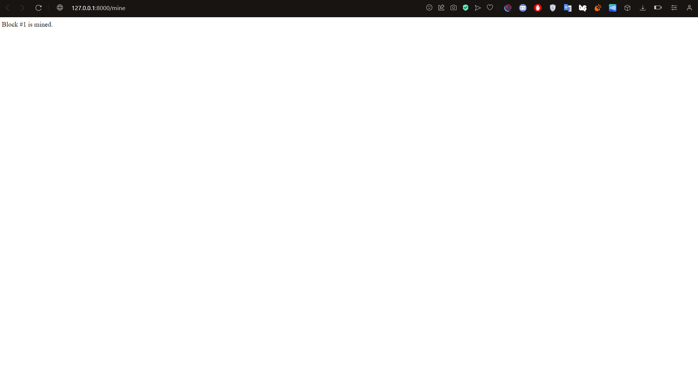
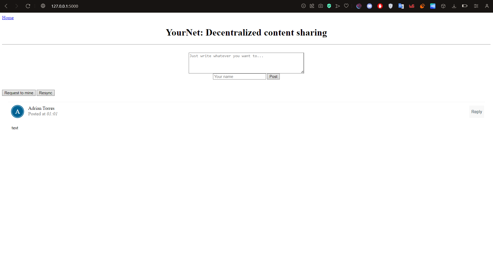

# Lab 10 — Blockchain
`hash_value.py` run 1

`hash_value.py` run 2

---
`snakecoin.py`

---
`snakecoin-server-full-code.py` on Terminal 1

Snakecoin-server website

Mined a new block on Terminal 2

Mined block website

---
`node_server.py` running on Terminal 1

`run_app.py` running on Terminal 2

Node server website

App website

