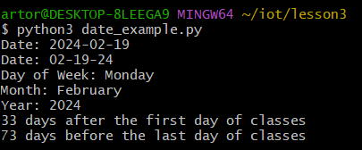
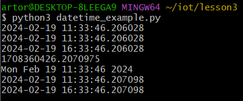
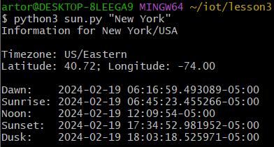
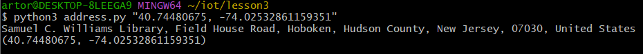

# Lab 2 — Python

`$ cd ~/iot`

*Description: Changes the current directory to the 'iot' directory*

---
`$ cd *3`

*Description: Changes the current directory to the 'lesson3' directory*

---
`$ python3 julian.py`

*Description: *

---
`$ python3 date_example.py`

*Description: *

---
`$ python3 datetime_example.py`

*Description: *

---
`$ python3 time_example.py`

*Description: *

---
`$ python3 sun.py "New York"`

*Description: *

---
`$ python3 moon.py`

*Description: *

---
`$ python3 coordinates.py "Samuel C. Williams Library"`

*Description: *

---
`$ python3 address.py "40.74480675, -74.02532861159351"`

*Description: *

---
`$ python3 cpu.py`

*Description: *

---
`$ python3 battery.py`

*Description: *

---
`$ python3 documentstats.py document.txt`

*Description: *

