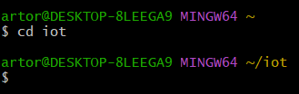
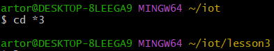
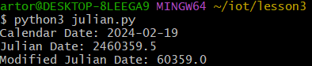
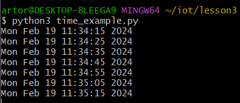
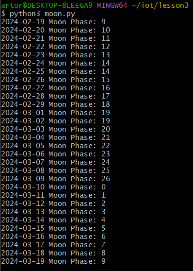
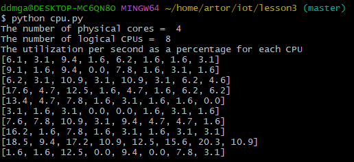
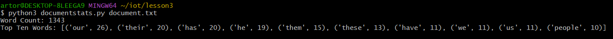

# Lab 3 — Python

`$ cd ~/iot`

*Description: Changes the current directory to the 'iot' directory*

---
`$ cd *3`

*Description: Changes the current directory to the 'lesson3' directory*

---
`$ python3 julian.py`

*Description: Displays the current calendar date, Julian date, and the modified Julian date*

---
`$ python3 date_example.py`

*Description: Displays the date with the year first, the date with the year last, the day of the week, the month, the year, days since class started, and days until class ends*

---
`$ python3 datetime_example.py`

*Description: Displays the current date and time*

---
`$ python3 time_example.py`

*Description: Displays the current date and time*

---
`$ python3 sun.py "New York"`

*Description: Displays the timezone, latitude, longitude, dawn, sunrise, noon, sunset, and dusk of New York today*

---
`$ python3 moon.py`

*Description: Displays the moon phases for today until the same day of next month*

---
`$ python3 coordinates.py "Samuel C. Williams Library"`

*Description: Displays the coordinates of the named location "Samuel C. Williams Library"*

---
`$ python3 address.py "40.74480675, -74.02532861159351"`

*Description: Displays the address of the specified coordinates*

---
`$ python3 cpu.py`

*Description: Shows physical cores, logical cores, and their utilization*

couldn't get psutil working on my original laptop, so I swapped to a different one

---
`$ python3 battery.py`

*Description: Displays the battery percentage, time left, and if it is plugged in*

The battery on this is completely dead, so the info is correct

---
`$ python3 documentstats.py document.txt`

*Description: Displays the word count and the top 10 words of the specified document*

