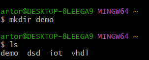

# Lab 2 — Command Line

`$ hostname`

*Description: Displays the hostname of the current computer or system*

---
`$ env`

*Description: It is used to display the environment variables present in the system*

---
`$ ps`

*Description: It lists out the running processes*

---
`$ pwd`

*Description: Prints the current working directory*

---
`$ git clone https://github.com/kevinwlu/iot.git`

*Description: Clones a repository from the specified link*

---
`$ cd iot`

*Description: Changes the current directory to the 'iot' directory*

---
`$ ls`

*Description: Lists the contents of the current directory*

---
`$ cd`

*Description: Changes the current directory to the home directory*

---
`$ df`

*Description: Displays disk space usage for all drives*

---
`$ mkdir demo`

*Description: Creates a new directory named 'demo' in the current directory*

---
`$ cd demo`

*Description: Changes the current directory to the 'demo' directory*

---
`$ nano file`

*Description: Opens the nano text editor within the terminal for the file named 'file'*

---
`$ cat file`

*Description: Displays the contents of the file named 'file'*

---
`$ cp file file1`

*Description: Copies the file named 'file' to a new file named 'file1'*

---
`$ mv file file2`

*Description: Renames the file named 'file' to 'file2'*

---
`$ rm file2`

*Description: Deletes the file named 'file2'*

---
`$ clear`

*Description: Clears the terminal screen*

---
`$ man uname`

*Description: Displays the manual page for the 'uname' command*

---
`$ uname -a`

*Description: Prints out terminal information*

---
`$ ipconfig`

*Description: Displays information about all active network interfaces*

---
`$ ping localhost`

*Description: Tests the network connectivity of the localhost*

---
`$ netstat`

*Description: Displays network connections, routing tables, interface statistics, masquerade connections, and multicast memberships*

